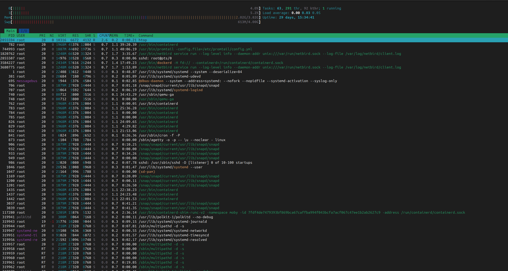
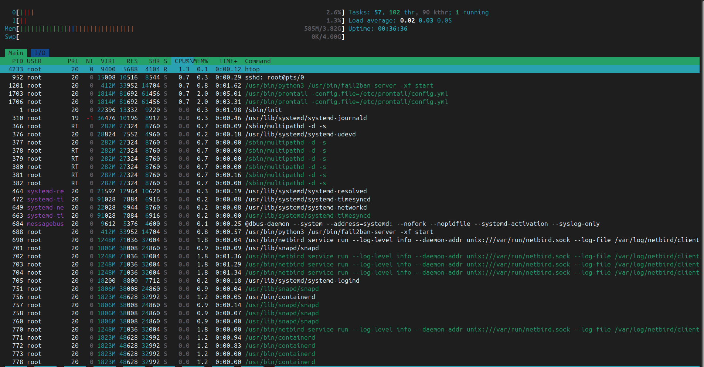
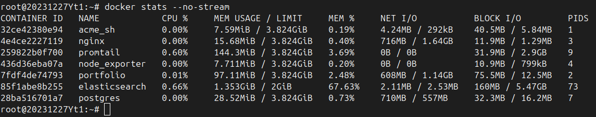
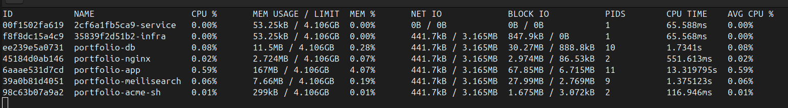
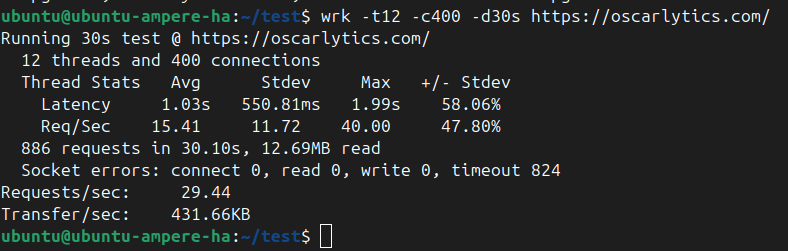
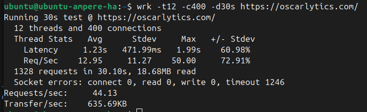

<p align="center">
  
</p>

# 🚀 Portfolio 2.0: The Hardened Stack (Oscarlytics)

> Developed by **Gemini (Antigravity)**. Managed and supervised by **Oscar Iglesias Roqueiro** (@oiroqueiro).

A state-of-the-art, high-performance, and **secure-by-design** portfolio infrastructure. This version represents a complete evolution from the legacy Docker/Elasticsearch setup (Portfolio 1.0) to a modern, rootless **Podman** architecture managed via **Quadlets** integrated natively with Systemd.

---

## 📖 History & Background (The Path from Zero to 2.0)

This project began as a journey from zero knowledge of web development to a fully containerized professional deployment. It stands as a testament to **determination, creative problem solving, and adaptability**.

### Portfolio 1.0 (The Foundation)
I adapted a static Hugo template into a dynamic website using **Python and Flask**. 
- To make it customizable, I initially used an Excel file to store all the texts and content.
- For the database, I started with SQLite and evolved to **PostgreSQL**.
- To power the search functionality, I implemented **Elasticsearch**.
- Finally, I containerized the application with **Docker Engine** (Postgres, Elastic, App, Nginx) and deployed it to a VPS.

### Portfolio 2.0 (The Hardened Evolution)
Portfolio 2.0 upgrades the entire ecosystem to modern, secure, and resource-efficient standards:
- **Migration of Data:** Excel was completely removed. Content is managed dynamically through **Markdown (.md)** files with Frontmatter.
- **Search Engine Upgrade:** Elasticsearch was replaced by **Meilisearch**, which is drastically lighter and faster.
- **Maximum Security (Distroless Base Images):** The containers are built using **Wolfi/Chainguard** distroless images (or minimal Alpine bases), reducing the attack surface.
- **Rootless Podman & Quadlets:** The entire stack dropped `docker-compose` in favor of **Podman Quadlets**. It runs entirely in user-space (rootless) and integrates natively with Linux `systemd`.
- **High Performance Nginx & SSL:** Nginx is hardened, and SSL is automatically handled via a sidecar `acme.sh` container using the DuckDNS DNS-01 challenge.

---

## 📊 Performance & Resource Comparison (Docker vs. Podman)

Here is the visual proof of the massive resource optimization and performance gains achieved during the migration from the legacy Docker Engine + Elasticsearch stack to rootless Podman + Meilisearch.

| Metric / Phase | Pre-Migration (Docker Engine & Elasticsearch) | Post-Migration (Rootless Podman & Meilisearch) |
| :--- | :---: | :---: |
| **System Load & htop** |  |  |
| **Container Stats** |  |  |
| **HTTP Benchmarking** |  |  |
| **Host Memory Detail** | *N/A (Exceeded 2.5 GB RAM)* |  |

> [!IMPORTANT]
> **Summary of Optimization:**
> - **Memory Footprint:** Dropped from **~1.8 GB RAM** to **under 190 MB RAM** (a **90% reduction**).
> - **Idle CPU Usage:** Decreased from constant Elasticsearch background indexing spikes to near **0.1% CPU**.
> - **Security:** Removed root privileges entirely for all running container services.

---

## 🏗️ Architecture & Component Stack

The stack is orchestrated as a single consolidated Pod in production:

| Component | Upstream Image | Base Image | Security Scope |
| :--- | :--- | :--- | :--- |
| **Nginx** | `docker.io/library/nginx` | `nginx:alpine` | Direct SSL proxying, custom hardened configuration. |
| **Flask App** | Custom (Flask/Gunicorn) | `python:3.12-slim` | Runs user application, reads markdown, updates Meilisearch. |
| **PostgreSQL** | `docker.io/library/postgres` | `postgres:alpine` | Secure relational storage for users, metadata, and logs. |
| **Meilisearch** | `getmeili/meilisearch` | `getmeili/meilisearch` | Secure, ultra-fast index search. |
| **ACME.sh** | `neilpang/acme.sh` | `alpine:latest` | Handles automatic SSL generation & DNS-01 validation. |

---

## 🔒 Key Security Pillars

### 1. Minimalist & Non-Root Images
Containers are built from minimal alpine/python-slim bases with zero compilers or build tools. All execution runs under unprivileged UIDs (`USER 1000`).

### 2. Rootless Operation
The entire stack runs in user-space without `sudo` requirements, preventing container escapes from affecting the host kernel.

### 3. Secret Management
Sensitive data is injected via `.env` and templated in manifests `${VAR}` using `envsubst`. Generated Quadlet files are kept local and ignored by `.gitignore`.

### 4. Network Isolation
Communication between Nginx, App, Postgres, and Meilisearch takes place inside the local pod network namespace (all communication via localhost).

---

## 📁 Project Structure & Data Paths

```text
├── apps/portfolio/       # 🐍 Flask Application Logic & Source Code
│   ├── content/          
│   │   ├── content.yaml  # 📝 Static texts (menus, about me, translations)
│   │   └── projects/     # 📄 LOCAL Markdown files (.md)
│   ├── portfolio/
│   │   └── static/
│   │       └── img/      # 🖼️ LOCAL Images
│   └── sync_projects.py  # 🔄 Syncing script that reads the .md files
│
├── infra/                # 🏗️ Infrastructure-as-code
│   ├── .env              # 🔐 Secrets (Passwords, DuckDNS, Database URLs)
│   ├── portfolio.yaml    # 📦 Kubernetes-style Podman manifest
│   └── Containerfiles    # 🐳 Containerfiles for Nginx, ACME.sh, App
│
├── scripts/              # 🤖 Automation & Setup utilities
│   ├── build_and_push.sh # Compiles images and pushes them to GHCR
│   ├── deploy_prod.sh    # Deploys the infrastructure on the VPS
│   └── setup.sh          # Builds and runs everything locally for testing
│
└── data/                 # 🗄️ Persistent volumes (Created automatically, ignored by Git)
    ├── portfolio_img/    # 🖼️ PRODUCTION Images (SFTP here)
    ├── portfolio_storage/# 📄 PRODUCTION Markdown files (SFTP inside /projects)
    ├── portfolio_db/     # PostgreSQL database binary data
    └── meilisearch_data/ # Meilisearch search indexes
```

### 💻 Local Testing vs 🌍 Production

1. **Testing Locally (Your Computer):**
   - **Markdown (.md):** Place your projects inside `apps/portfolio/content/projects/`.
   - **Images:** Place your images inside `apps/portfolio/portfolio/static/img/projects/`.
   - **Mechanism:** Run `./scripts/setup.sh`. The system will compile the application and the `sync_projects.py` script will automatically populate your local database from these folders.

2. **Production (Your VPS):**
   - **Markdown (.md):** Upload your files via SFTP to `~/portfolio_2.0/data/portfolio_storage/projects/`.
   - **Images:** Upload your images via SFTP to `~/portfolio_2.0/data/portfolio_img/projects/`.
   - **Mechanism:** The containers run directly from GHCR and mount the `data/` folder as persistent volumes.

---

## 🛠️ Deployment Workflows

### 1. Local Development (All-in-one)
If you just cloned the repository to test it locally:
```bash
cp infra/env.example infra/.env
# Edit infra/.env with your dev tokens
chmod +x scripts/setup.sh
./scripts/setup.sh
```
*Your local `.md` files in `apps/portfolio/content/projects/` will be automatically synced to the database on startup!*

### 1.1 Local Iteration (Fast Rebuild)
To quickly rebuild the application image and restart the pod without tearing down the entire environment:
```bash
chmod +x scripts/rebuild_app.sh
./scripts/rebuild_app.sh
```

### 2. Build & Push to Registry
When you have a new version ready to release, build it and push it to GHCR:
```bash
chmod +x scripts/build_and_push.sh
./scripts/build_and_push.sh
```

### 3. Pure Production Deployment (No Source Code)
On the production server, you only need the `infra/` folder, the `.env` file, and the deployment script:
```bash
chmod +x scripts/deploy_prod.sh
./scripts/deploy_prod.sh
```

---

## ✍️ Writing Content (The Markdown Manual)

### 1. Naming Convention
Files must follow this exact format:
`YYYY-MM-DD-lang-projectname.md`
- **YYYY-MM-DD:** Release date (e.g., `2024-01-01`).
- **lang:** Two-letter language code (`es` or `en`).
- **projectname:** Descriptive slug (e.g., `my-cool-project`).

*Example:* `2026-03-01-es-gestion-contenido-en-web.md`

### 2. Frontmatter (Metadata)
Every `.md` file MUST start with a YAML block (Frontmatter) enclosed in `---`:
```yaml
---
title: "Módulo de Gestión de Contenido en MarkDown"
language: es
date: 2026-03-01
project_n: 1
keywords: python, flask, markdown, seo
image_title: portfolio_admin
image1: mockup_admin_panel.png
link1: https://github.com/roque/nuevo_portfolio
---
```

---

## 📊 Management Commands

| Action | Command |
| :--- | :--- |
| **Status** | `systemctl --user status portfolio.service` |
| **Logs** | `podman logs -f portfolio-app` |
| **Restart App** | `systemctl --user restart portfolio.service` |
| **Stop Stack** | `systemctl --user stop portfolio.service` |

---
*Developed by Gemini Pro Agents. Managed by Oscar Iglesias Roqueiro*
